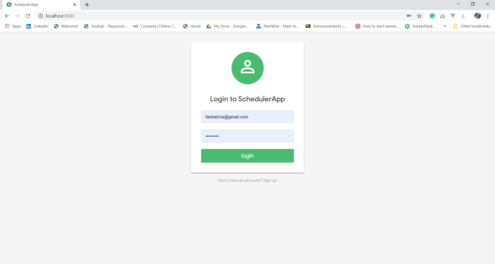
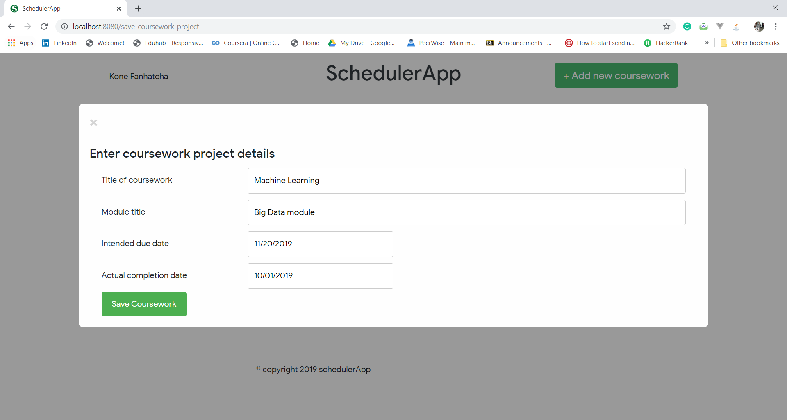
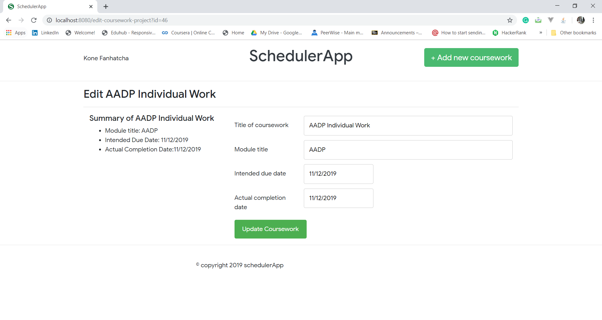
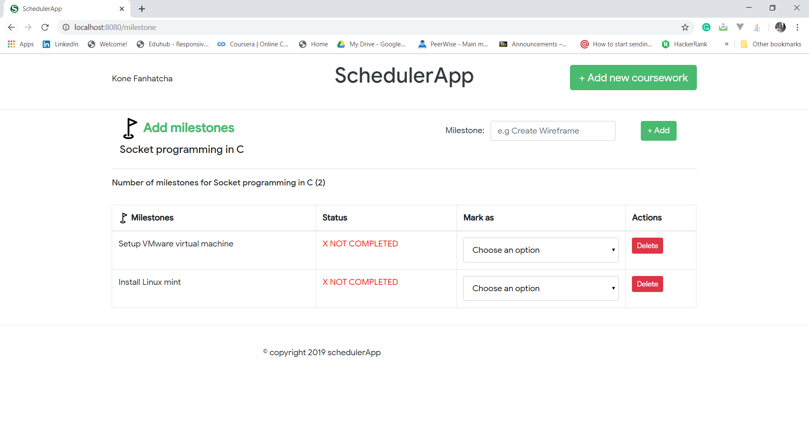
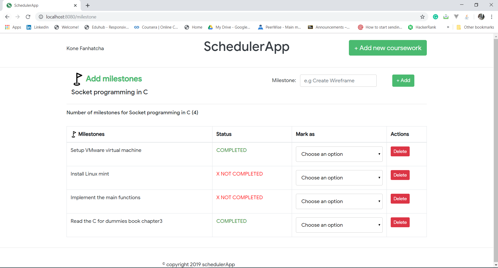
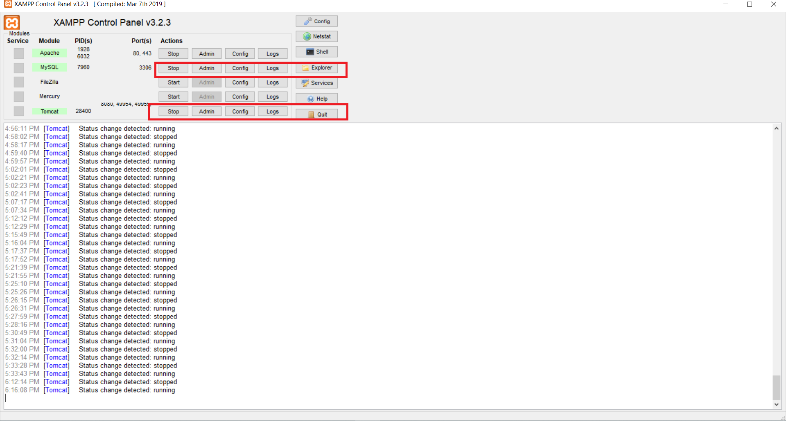
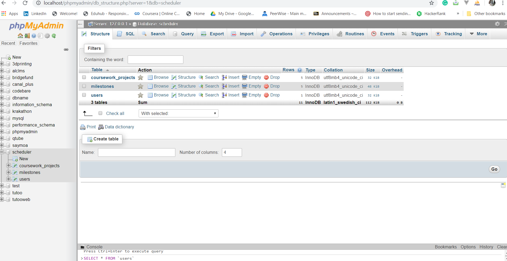
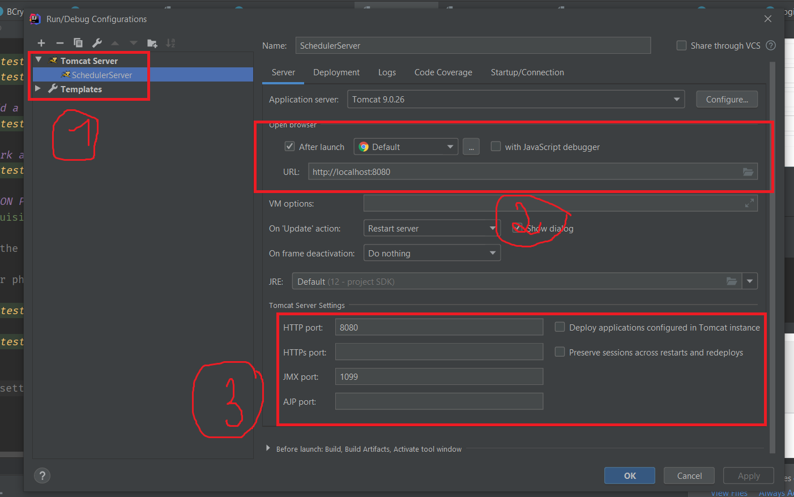
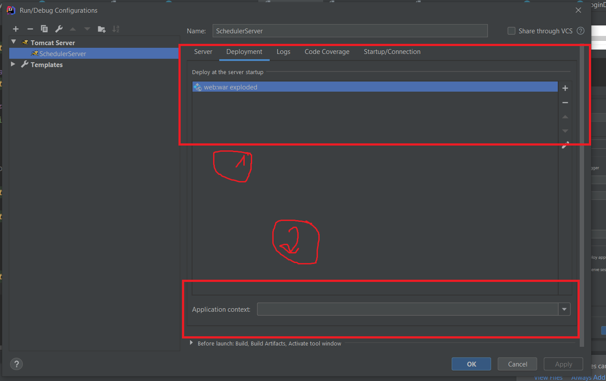

# **Scheduler App V.1.0**

Scheduler Web app built using Java EE + MySQL + Tomcat + JSTL 


###ABOUT SCHEDULER APP
Problem Description: Coping with many coursework deliverables is a stressful part of every student’s life.SchedulerApp is a web-based which aims to help students cope with multiple coursework assignments.  
The app allows the student to perform the following operations:
###### 1. Register to the app


###### 2. Log In / Log Out


###### 3. Coursework projects (Create - Update - Edit - Delete)





###### 4. Add a list of milestones to the coursework projects


###### 5. mark a milestone a completed or not


##INSTALLATION PROCESS
> 1 - Prerequisites
```
A - Have one of the following IDEA: Intellij IDEA, Eclipse, Netbeans etc

B-  Have XAMPP or phpMyAdmin installed (Not required)
```




```
C-  Have Tomcat server setted up with you Intellij IDEA
```




> 2 - Clone the repo using the following command
```cmd
git clone https://github.com/FANHATCHA/schedulerapp.git
```
 