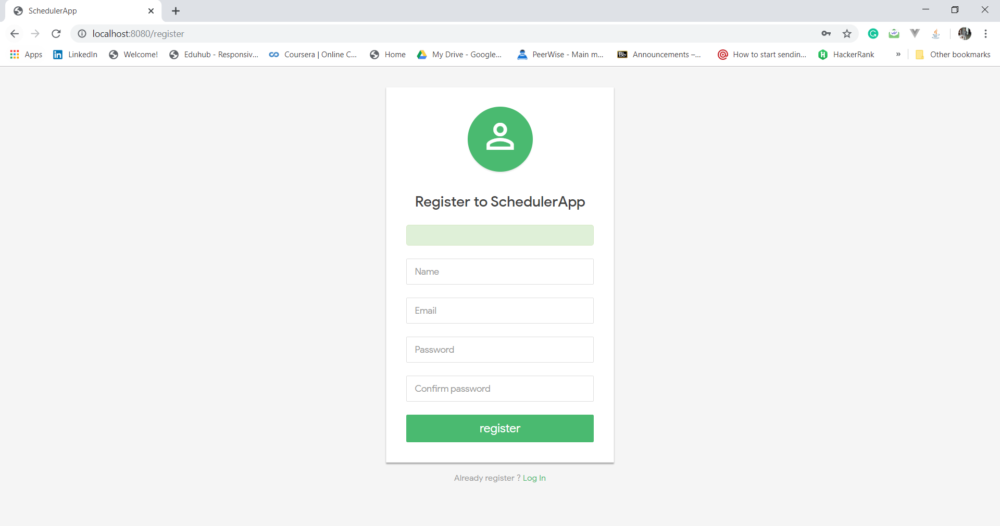

# **Scheduler App V.1.0**

Scheduler Web app built using Java EE + MySQL + Tomcat + JSTL 


## ABOUT SCHEDULER APP
Problem Description: Coping with many coursework deliverables is a stressful part of every student’s life.SchedulerApp is a web-based which aims to help students cope with multiple coursework assignments.  
The app allows the student to perform the following operations:
### 1. Register to the app


### 2. Log In / Log Out


### 3. Coursework projects (Create - Update - Edit - Delete)


### 4. Add a list of milestones to the coursework projects


### 5. mark a milestone a completed or not


## INSTALLATION PROCESS
> #### 1 - Prerequisites
##### A - Have one of the following IDEA: Intellij IDEA, Eclipse, Netbeans etc
##### B - Have XAMPP or phpMyAdmin installed (Not required). You can other DBMS however make sure you have the right driver.


##### C -  Have Tomcat server running with your Intellij IDEA


> #### 2 - Clone the repo using the following command
```cmd
git clone https://github.com/FANHATCHA/schedulerapp.git
```
 > #### 3 - Import database in phpMyAdmin or other DBMS installed in your system
 ##### A - Make sur your have the **db.sql** file in the directory you have just clone
 
 
 
 ##### B - Open your phpMyAdmin and follow the step highlighted in red to create a new database
 
 
 ##### C - Import the **db.sql** file into your newly created database
 


##### D - If you have followed the same steps as me, you will open the following result


 